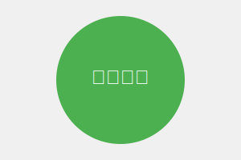

# 新闻网站

这是一个可以根据`wz_数字.html`文件动态增加文章的新闻网站。

## 功能特点

- 自动检测并加载所有`wz_数字.html`格式的文章文件
- 文章按发布日期自动排序（最新的在前）
- 响应式设计，适配不同设备屏幕
- 简洁美观的界面

## 如何使用

### 查看新闻

1. 打开`index.html`文件即可查看所有已添加的新闻文章
2. 点击任意文章卡片可查看文章详情

### 添加新文章

系统现在支持三种文章文件格式：HTML格式、Markdown格式(.md)和更简单的TXT格式。

### Markdown格式文章（推荐的简单方式）

Markdown格式支持标题、列表、引用、代码块和本地图片，是一种平衡简洁和功能的很好选择：

```markdown
# 文章标题

发布日期：2024年6月24日



## 二级标题

这是Markdown格式的文章内容。

- 项目1
- 项目2
- 项目3

> 这是一段引用

```
这是代码块
```

**加粗文本** 和 *斜体文本*

[返回首页](index.html)
```

### TXT格式文章（最简单的方式）

TXT格式是最简单的文章创建方式，无需编写任何HTML代码。格式约定如下：

```txt
文章标题
发布日期（YYYY-MM-DD格式）
图片路径（支持本地图片路径或网络图片URL）
文章内容（第四行及以后的所有内容都是正文）
```

**示例：wz_数字.txt**
```txt
这是一篇TXT格式的测试文章
2024-06-20
test_image.svg
这是TXT格式文章的正文内容。通过这种格式，用户可以更简单地创建新闻文章，不需要编写HTML代码。

系统会自动解析TXT文件的格式：
- 第一行作为文章标题
- 第二行作为发布日期
- 第三行作为图片路径
- 第四行及以后作为文章内容
```

## 可视化文章创建器

为了更方便地创建符合格式的文章，本项目提供了一个Python可视化工具`article_creator.py`。

### 功能特点

1. **多格式支持**：支持生成简洁版HTML、Markdown和TXT三种格式的文章
2. **可视化编辑**：提供友好的图形界面，无需手动编写代码
3. **媒体插入**：支持插入本地图片和视频（HTML格式）
4. **分类设置**：可以为文章设置分类，并自动应用到文件名中
5. **自动编号**：自动检测并分配文章编号
6. **Markdown编辑工具**：为Markdown格式提供常用的格式化按钮

### 使用方法

1. **运行程序**：双击运行 `article_creator.py` 文件
2. **选择文章格式**：在顶部选择你想要创建的文章格式（HTML、Markdown或TXT）
3. **设置文章编号**：程序会自动检测并填写下一个可用的编号，你也可以手动修改
4. **选择文章分类**：从下拉菜单中选择文章分类（杂、bug修复、模组发布、公告发布）
5. **填写文章信息**：输入文章标题和发布日期
6. **插入媒体**（可选）：点击"浏览..."按钮选择要插入的图片和视频文件
7. **编写文章正文**：在文本框中输入文章内容
8. **生成文章**：点击"生成文章"按钮，程序会在当前目录生成对应的文件

### 文件命名规则

生成的文件将按照以下规则命名：
- 默认格式：`wz_编号.格式`（例如：`wz_13.html`）
- 带分类的格式：`wz_编号_分类.格式`（例如：`wz_13_模组发布.html`）
  - 注意：只有当分类不是"杂"时，才会在文件名中添加分类标识

### HTML格式文章

如果需要更复杂的文章结构，可以使用HTML格式。

#### 简化版HTML文章模板（推荐）

简洁版HTML格式支持直接使用本地图片路径，您可以在img标签的src属性中直接指定本地图片文件名：

```html
<!DOCTYPE html>
<html lang="zh-CN">
<head>
    <meta charset="UTF-8">
    <meta name="viewport" content="width=device-width, initial-scale=1.0">
    <title>文章标题</title>
    <meta name="description" content="文章简短描述">
    <meta name="date" content="2024-06-15">
    <link rel="stylesheet" href="style.css">
</head>
<body>
    <h1>文章标题</h1>
    <p class="article-date">2024年6月15日</p>
    <!-- 直接使用本地图片文件名 -->
    
    <!-- 直接使用本地视频文件名 -->
    <video controls>
        <source src="your_video.mp4" type="video/mp4">
        您的浏览器不支持HTML5视频播放。
    </video>
    <p>文章内容段落1...</p>
    <p>文章内容段落2...</p>
    <p><a href="index.html">返回首页</a></p>
</body>
</html>
```

**多图片和视频示例**：

```html
<!DOCTYPE html>
<html lang="zh-CN">
<head>
    <meta charset="UTF-8">
    <meta name="viewport" content="width=device-width, initial-scale=1.0">
    <title>多图片文章</title>
    <meta name="description" content="包含多个本地图片的文章">
    <meta name="date" content="2024-06-15">
    <link rel="stylesheet" href="style.css">
</head>
<body>
    <h1>多图片和视频文章标题</h1>
    <p class="article-date">2024年6月15日</p>
    
    <p>文章介绍...</p>
    
    <!-- 第一个本地图片 -->
    
    
    <p>内容段落1...</p>
    
    <!-- 本地视频 -->
    <video controls>
        <source src="your_video.mp4" type="video/mp4">
        您的浏览器不支持HTML5视频播放。
    </video>
    
    <p>内容段落2...</p>
    
    <!-- 第二个本地图片 -->
    
    
    <p><a href="index.html">返回首页</a></p>
</body>
</html>
```

#### 完整版HTML文章模板

如果需要更复杂的文章结构，可以使用以下完整版模板：

```html
<!DOCTYPE html>
<html lang="zh-CN">
<head>
    <meta charset="UTF-8">
    <meta name="viewport" content="width=device-width, initial-scale=1.0">
    <meta name="description" content="这里是文章摘要，会显示在新闻列表中">
    <meta name="date" content="2023-10-16"> <!-- 发布日期，格式为YYYY-MM-DD -->
    <title>文章标题</title>
    <link rel="stylesheet" href="style.css">
</head>
<body>
    <header>
        <h1>新闻详情</h1>
    </header>
    
    <main>
        <article class="news-article">
            <h2>文章标题</h2>
            <div class="article-meta">
                <span class="article-date">发布日期：2023年10月16日</span>
            </div>
            
            <div class="article-content">
                
                
                <p>文章内容...</p>
                <!-- 更多段落 -->
            </div>
        </article>
    </main>
    
    <footer>
        <p>&copy; 2023 新闻网站. 保留所有权利.</p>
        <p><a href="index.html">返回首页</a></p>
    </footer>
</body>
</html>
    
    <!-- 直接使用本地视频文件名 -->
    <video controls>
        <source src="your_video.mp4" type="video/mp4">
        您的浏览器不支持HTML5视频播放。
    </video>
    <p>文章内容段落1...</p>
    <p>文章内容段落2...</p>
    <p><a href="index.html">返回首页</a></p>
</body>
</html>
```

**多图片和视频示例**：

```html
<!DOCTYPE html>
<html lang="zh-CN">
<head>
    <meta charset="UTF-8">
    <meta name="viewport" content="width=device-width, initial-scale=1.0">
    <title>多图片文章</title>
    <meta name="description" content="包含多个本地图片的文章">
    <meta name="date" content="2024-06-15">
    <link rel="stylesheet" href="style.css">
</head>
<body>
    <h1>多图片和视频文章标题</h1>
    <p class="article-date">2024年6月15日</p>
    
    <p>文章介绍...</p>
    
    <!-- 第一个本地图片 -->
    
    
    <p>内容段落1...</p>
    
    <!-- 本地视频 -->
    <video controls>
        <source src="your_video.mp4" type="video/mp4">
        您的浏览器不支持HTML5视频播放。
    </video>
    
    <p>内容段落2...</p>
    
    <!-- 第二个本地图片 -->
    
    
    <p><a href="index.html">返回首页</a></p>
</body>
</html>
```

#### 完整版HTML文章模板

如果需要更复杂的文章结构，可以使用以下完整版模板：

```html
<!DOCTYPE html>
<html lang="zh-CN">
<head>
    <meta charset="UTF-8">
    <meta name="viewport" content="width=device-width, initial-scale=1.0">
    <meta name="description" content="这里是文章摘要，会显示在新闻列表中">
    <meta name="date" content="2023-10-16"> <!-- 发布日期，格式为YYYY-MM-DD -->
    <title>文章标题</title>
    <link rel="stylesheet" href="style.css">
</head>
<body>
    <header>
        <h1>新闻详情</h1>
    </header>
    
    <main>
        <article class="news-article">
            <h2>文章标题</h2>
            <div class="article-meta">
                <span class="article-date">发布日期：2023年10月16日</span>
            </div>
            
            <div class="article-content">
                
                
                <p>文章内容...</p>
                <!-- 更多段落 -->
            </div>
        </article>
    </main>
    
    <footer>
        <p>&copy; 2023 新闻网站. 保留所有权利.</p>
        <p><a href="index.html">返回首页</a></p>
    </footer>
</body>
</html>
```

## 技术实现

- HTML5 语义化标签构建页面结构
- CSS3 实现响应式设计和美观样式
- JavaScript 动态加载和显示文章
- 无需后端服务器，纯静态网站

## 本地视频使用指南

在HTML文章中，您可以直接嵌入本地视频文件，无需上传到网络服务器：

### 步骤：
1. 将视频文件放在与HTML文件相同的目录中
2. 使用video标签，例如：
   ```html
   <video controls>
       <source src="your_video.mp4" type="video/mp4">
       您的浏览器不支持HTML5视频播放。
   </video>
   ```
3. 支持的视频格式：MP4 (.mp4)、WebM (.webm)、Ogg (.ogg)

### 视频标签常用属性：
- `controls` - 显示播放控制
- `width` 和 `height` - 设置视频尺寸
- `autoplay` - 自动播放（通常需要静音）
- `loop` - 循环播放
- `muted` - 静音播放

## 注意事项

- 新创建的文章文件需要与`index.html`在同一目录下
- 目前系统会尝试加载`wz_1.html`到`wz_20.html`，如需增加更多文章，请修改`script.js`中的循环范围
- 为了获得最佳显示效果，请确保文章文件包含适当的元数据和内容结构
- 对于较大的视频文件，加载时间可能会较长，请耐心等待